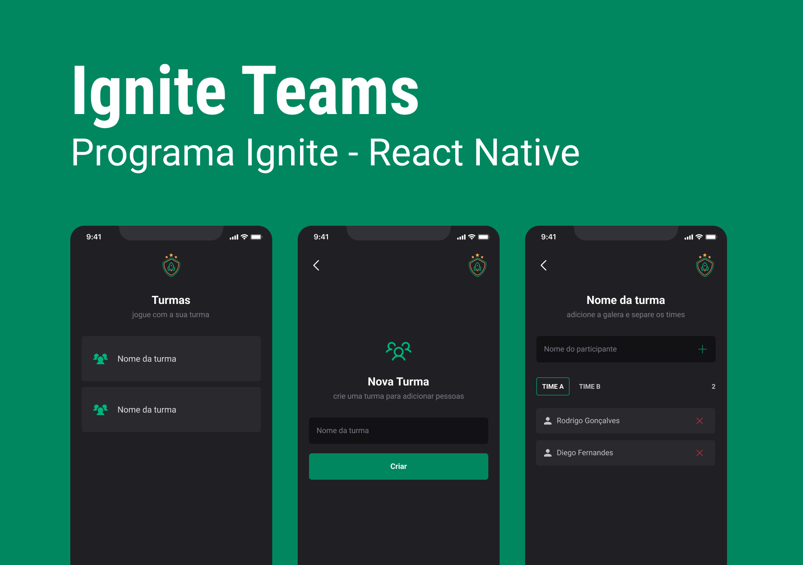

# Ignite Teams



## About

Project develop in course Ignite React Native´s (chapter 02).

In this project I could use the follow tecnologies:

 - React - v18.2.0
 - React Native (useState, useContext, useCallback, useMemo) - v0.71.8 
 - TypeScript
 - Expo - v48.0.18
 - StyledComponent (library for style components and screens)
 - Phospor (icons´s library)
 - LocalStorage (for save/get data in local storage)
 - React Router Dom (library for router screens)

In this chapter i could learn more about React Native´s route and how to use the library React Router Dom for this purpose. 

Also, I was able to use the ligrary StyledComponent for styles the component´s and for create a main theme for the application.

Other knowledge that I learned about, was to use LocalStorage for storing and retrieving data.

## Installation


Install the dependencies and devDependencies and start the server.

```sh
cd igniteteams
npx install
npx expo start

```

## License

MIT
